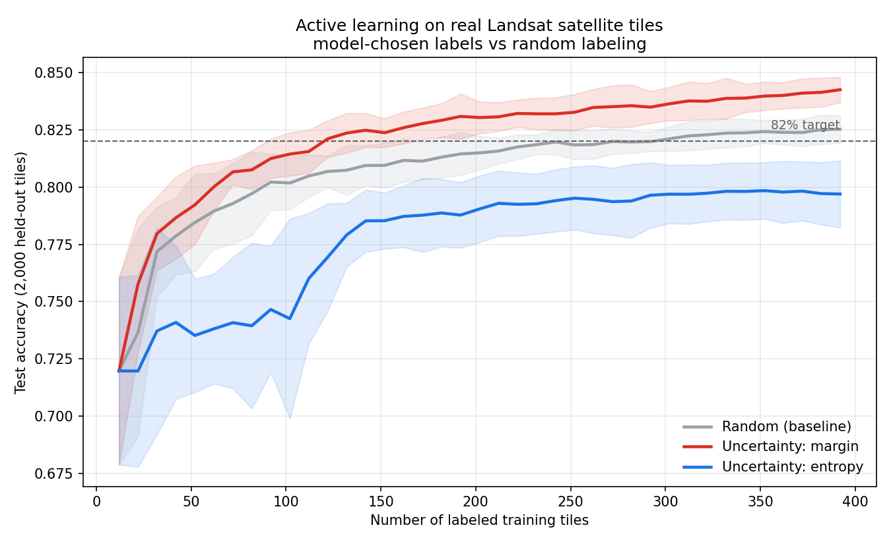

# Active Learning on Satellite Imagery — 60% Fewer Labels, Same Accuracy

[](https://www.python.org/)
[](LICENSE)
[](tests/)

In Earth-observation and planetary science, **pixels are cheap but expert labels are the bottleneck** — a geologist's time to say *"that tile is cropland / red soil / very damp grey soil."* This repo is a small, reproducible study showing that **active learning** — letting the model choose which tiles get labeled — reaches the same accuracy as random labeling with **60% fewer labels** on a real Landsat benchmark.



## Result

Averaged over 12 random seeds on a fixed 2,000-tile held-out test set:

| Strategy | Labels to reach 82% accuracy | vs. random |
| --- | --- | --- |
| Random (baseline) | 302 | — |
| **Uncertainty: margin** | **122** | **−60%** |
| Uncertainty: entropy | not reached within budget | *worse than random* |

Two takeaways:

1. **Margin sampling wins big.** Labeling the tiles the model is most torn between (smallest gap between its top-two class guesses) puts each label where it moves the decision boundary most.
2. **The query strategy is the whole ballgame.** Naive *entropy* sampling underperforms random here — a real, well-documented failure mode where maximizing raw uncertainty chases ambiguous outliers and ignores whether they're representative. Active learning is not magic; a plausible-sounding strategy can backfire.

## Data

[Statlog (Landsat Satellite)](https://archive.ics.uci.edu/dataset/146/statlog+landsat+satellite) — real Landsat MSS imagery, ~80 m/pixel. Each sample is 36 features (4 spectral bands × a 3×3 pixel neighbourhood); the task is the 6-class surface type of the centre pixel. 6,435 tiles (4,435 pool + 2,000 test). The dataset is downloaded automatically on first run (CC BY 4.0; citation below).

## Install

```bash
git clone https://github.com/your-username/active-learning-landsat.git
cd active-learning-landsat
pip install -e .          # or: pip install -r requirements.txt
```

## Run

```bash
python -m active_learning                 # reproduces the figure + table above
python -m active_learning --target-acc 0.83 --seeds 20 --batch 5
```

Use it as a library:

```python
from active_learning import load_landsat, run_experiment, labels_to_target

X_pool, y_pool, X_test, y_test = load_landsat()
results = run_experiment(X_pool, y_pool, X_test, y_test, n_seeds=12)
print(labels_to_target(results["Uncertainty: margin"], 0.82))   # -> 122
```

## How it works

Pool-based active learning. Start from a tiny stratified seed (2 labels/class), then repeat: train a probabilistic classifier → score every unlabeled tile → request labels for the most informative batch → retrain.

```
seed labels ─▶ train ─▶ score pool by uncertainty ─▶ acquire top-k ─▶ retrain ─▶ …
                  ▲                                                        │
                  └────────────────────────────────────────────────────────┘
```

## Project layout

```
active_learning/
  data.py         # auto-download + load the Landsat benchmark
  strategies.py   # query strategies (registry: random, margin, entropy, least_confidence)
  experiment.py   # active-learning loop + multi-seed runner
  plotting.py     # learning-curve figure
  __main__.py     # CLI: python -m active_learning
tests/            # unit + integration tests (no network needed)
```

## Extending to raw image tiles (HiRISE / EuroSAT)

The loop is feature-agnostic. The Landsat features come pre-extracted; to run on raw image tiles, swap `load_landsat()` for a loader that pushes tiles through a **feature extractor** — a frozen pretrained CNN/ViT encoder, or classic texture features (Gabor / Haralick / wavelet) — and returns the same `(X, y)` matrix. Everything downstream is unchanged.

Add your own strategy in a few lines:

```python
from active_learning.strategies import register_strategy

@register_strategy("my_strategy")
def my_strategy(probs, rng, k):
    ...                      # return indices of the k tiles to label next
```

A natural next step is a **hybrid** strategy that blends uncertainty with representativeness (e.g. BADGE / coreset-style batch selection) — the standard fix for the entropy failure shown above.

## Tests

```bash
pip install -e ".[dev]"
pytest -q
```

## Citation

> Srinivasan, A. (1993). *Statlog (Landsat Satellite)*. UCI Machine Learning Repository. https://doi.org/10.24432/C55887 — CC BY 4.0

## License

MIT — see [LICENSE](LICENSE).
